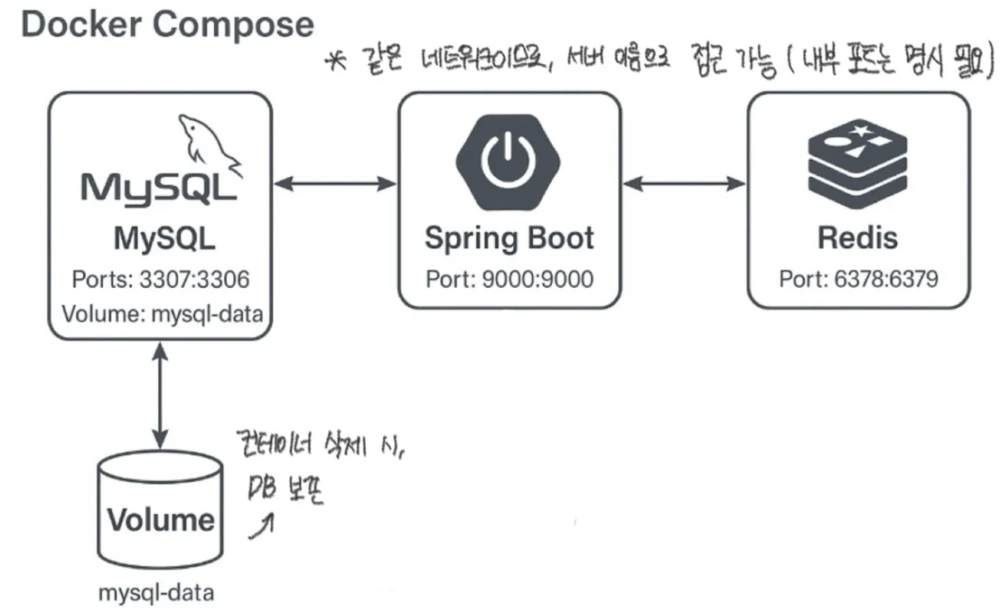
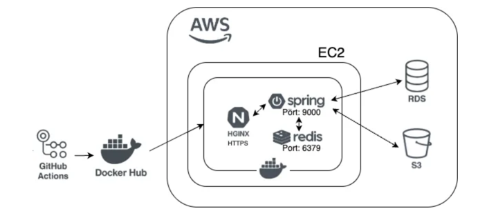

# CtrlU_Backend
Ctrl U 프로젝트 백엔드 레포지토리입니다!!

## 프로젝트 환경
- 자바 17
- 스프링부트 3.4.4
- AWS: EC2, RDS
- Database: MySQL, H2 Database, Redis 
- 배포 및 운영: Github Action, Nginx, Docker
- 
## 로컬 환경
### 아키텍처


### 🦮실행 가이드
1. 실행하는 서버에 docker와 docker-compose 설치가 필요합니다.
2. 프로젝트 하위에 Dockerfile과 docker-compose.yml이 존재하는지 확인합니다.
3. 프로젝트 하위에 .env 파일을 생성합니다. (.env 파일은 private 정보라 git에 올리지 않았습니다.)

    ```sql
    # ===== 🌱Spring용 DB 접속 정보 =====
    LOCAL_DB_URL=jdbc:mysql://mysql:3307/ctrl_u
    LOCAL_DB_USERNAME=foureach
    LOCAL_DB_PASSWORD=foureach1234
    
    # ===== 🐳도커용 MySQL 설정 ====
    MYSQL_ROOT_PASSWORD=docker1234
    MYSQL_DATABASE=ctrl_u
    MYSQL_USER=foureach
    MYSQL_PASSWORD=foureach1234
    ```

4. spring 프로젝트를 빌드합니다. (우측 gradle>tasks>build>build)
5. 터미널에서 docker-compose run을 실행합니다. (명령 실행 위치 주의!)

    ```sql
    docker-compose -f docker-compose.local.yml up --build
    ```

6. 컨테이너 명령어를 사용해 다음과 같은 동작을 할 수 있습니다.

    ```sql
    #컨테이너 상태 확인
    docker ps
    
    #컨테이너 로그 보기
    docker logs spring-app
    
    #컨테이너 중지
    docker-compose down
    
    #컨테이너 중지(볼륨까지)
    docker-compose down -v
    ```

7. 컨테이너 오류로 다시 실행하고 싶을 때, 컨테이너를 꼭 제거하고 다시 run 합니다.

    ```sql
    docker stop spring-app
    docker rm spring-app
    ```
   
## 운영 환경
### 아키텍처
